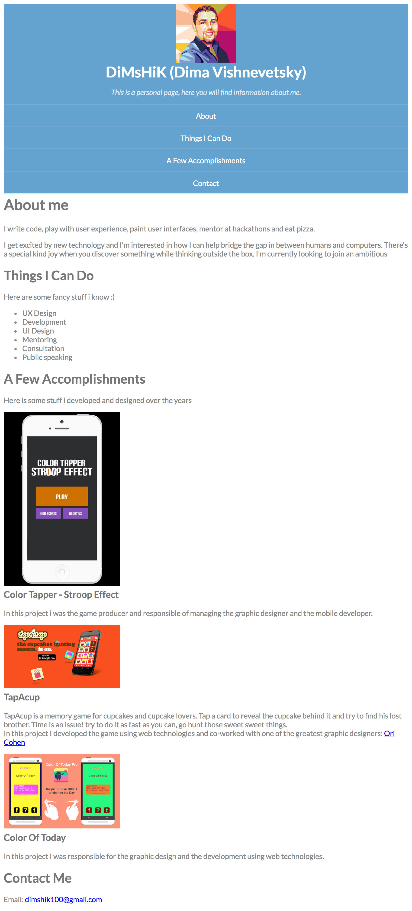

# Style your personal info page

Your page looks... ugly right now. It's time to style it, so that it will look
something like this:

---

---

## CSS File

* The CSS rules should not reside in the HTML file, but should be in a file.

## Text Styling

* The body text color you see is `#888`.
* The body font family is Lato, which is a sans-serif.
  * Get it from here * [Lato](https://fonts.googleapis.com/css?family=Lato:400,400italic,700,700italic)
* Regular links should have an underline by default, but on hover the
  underline color will change to the color `#64a2d0` and the underline will be removed.

## Header styling

* The text color of all headers is `#D8E7F3`, and the background color is`#64a2d0`.
* Set `H1` title that placed inside the header to have white `#ffffff` text color.
* Center horizontally all the contents of the header.
* Set the paragraph inside the header to have an `italic` font style.

## Step 3 - Create a menu

* Create a `div` with the class `header` at the top of the page.
  * Move your image, the main `H1` title and the paragraph inside the header div.
  * Create a menu with links to sections of the page inside the header and add the class `nav` to it.
* The menu items, should not show the bullet (how? look it up on the internet!).
  Pay attention that other lists on the page should not be affected.
* Set the color of the links in the menu to be white and without an underline.
* Set the padding top and bottom of every link in the menu to be `0.85em`.
  Don't forget to change the links to be displayed as blocks.
* Set the top border of every list item in the menu to be `solid` with `2px` width and
  have the color `#73ABD4`.
* To make our menu take all the width of the parent container, override browsers default margin and padding to be 0.

