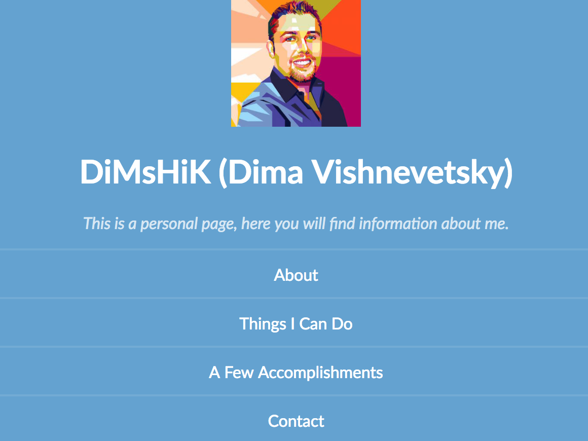

# Style your personal info page

<!-- TOC depthFrom:2 -->

- [Step 1 - Basic styling](#step-1---basic-styling)
- [Step 2 - Header styling](#step-2---header-styling)
- [Step 3 - Create a menu](#step-3---create-a-menu)

<!-- /TOC -->

- All work should be done in `projects > personal-page > styles.css`.

## Step 1 - Basic styling

- Set default body text color is `#888`.
- Set default body font-family: "Lato", sans-serif;
  - get it from here - [Lato](https://fonts.googleapis.com/css?family=Lato:400,400italic,700,700italic)
- Regular links should have an underline by default.
  - On hover the color will change to `#64a2d0` and the underline will be removed.

## Step 2 - Header styling

- Set background color of header div to `#64a2d0` and the text color to `#D8E7F3`.
- Set `H1` title that placed inside the header to have white `#ffffff` text color.
- Center horizontally all the contents of the header.
- Set the paragraph inside the header to have an `italic` font style.

## Step 3 - Create a menu

- Create a `div` with the class `header` at the top of the page.
  - Move your image, the main `H1` title and the paragraph inside the header div.
  - Create a menu with links to sections of the page inside the header and add the class `nav` to it.
- The menu items, should not show the bullet (how? look it up on the internet!).
  Pay attention that other lists on the page should not be affected.
- Set the color of the links in the menu to be white and without an underline.
- Set the padding top and bottom of every link in the menu to be `0.85em`.
  Don't forget to change the links to be displayed as blocks.
- Set the top border of every list item in the menu to be `solid` with `2px` width and
  have the color `#73ABD4`.
- To make our menu take all the width of the parent container, override browsers default margin and padding to be 0.

